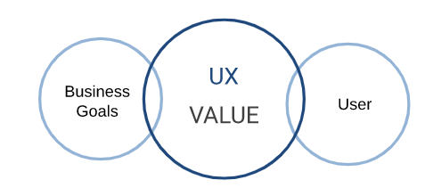
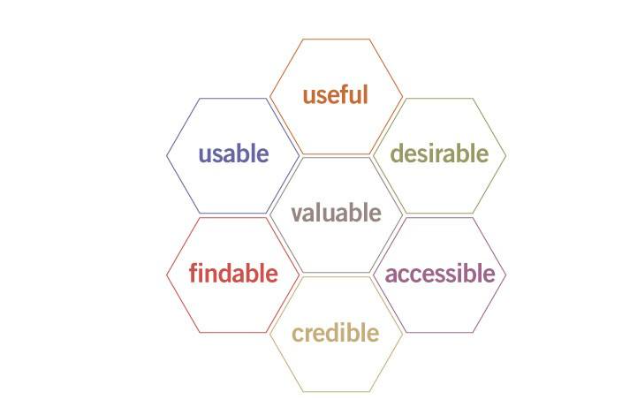
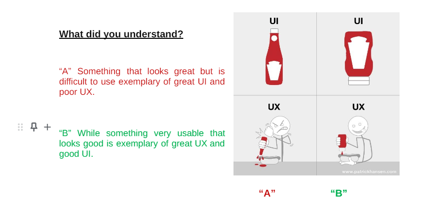

# Introduction To UI/UX

UX (User Experience) and UI (User Interface) design are two important aspects of designing digital products such as websites, mobile applications, and software. UX design focuses on understanding the needs and behaviors of users to create a positive experience when using a digital product. UI design, on the other hand, focuses on the visual and interactive aspects of a product, such as the layout, typography, and colors.

The goal of UX/UI design is to create a product that is intuitive, user-friendly, and visually appealing. This involves conducting user research to understand user needs, designing wireframes and prototypes to test and iterate the product design, and collaborating with developers to ensure the final product meets the design specifications.

UX/UI design is important because it directly impacts how users interact with a digital product, and a good design can lead to increased engagement, retention, and satisfaction. A poor design, on the other hand, can lead to frustration, confusion, and user abandonment.

Overall, UX/UI design is a critical component of creating successful digital products, and involves a combination of research, creativity, and collaboration.

## What is a UX?

UX design 
User Experience “UX” design is the process used to create products that provide meaningful and relevant experiences to users. This involves the design of the entire process of acquiring and integrating the development, including aspects of branding, design, usability, and function.
-   User Experience is the value that you provide to your user when he is using your product.

## What is a UI?

-   User Interface “UI” design is focused on the look and layout — how each element of the product will look, including buttons, text, images, checkboxes, and any visual interface elements people interact with.      

-   UI is a part of UX because it affects the overall experience.

##  Factors of the User Experience

###  Difference between UX & UI design   

Here’s what they had to say about the difference between UI and UX:

   - UX is focused on the user’s journey to solve a problem, UI is focused on how a product’s surfaces look and function. 
   - 
   - A UX designer is concerned with the conceptual aspects of the design process, leaving the UI designer to focus on the more tangible elements. “Andy Budd”
    
-  UI is the bridge that gets us where we want to go, UX is the feeling we get when we arrive. “Jason Ogle”
    
-   UI is focused on the product, a series of snapshots in time. UX focuses on the user and their journey through the product. “Scott Jenson”
    

Understanding your users is critical to creating a successful product or service. Here are some techniques and methods for researching and developing a deep understanding of your users:

1.  User Research Techniques: There are various techniques for conducting user research, including surveys, interviews, focus groups, and usability testing. These methods can help you understand users' needs, behaviors, pain points, and preferences.
    
2.  Developing User Personas: Personas are fictional characters that represent your target users. They help you to visualize and understand your users' needs, behaviors, and motivations. Personas should be based on data from user research and should include information such as demographics, goals, pain points, and behaviors.
    
3.  User Scenarios and Use Cases: Scenarios and use cases help you to understand how users will interact with your product or service. They provide a detailed description of how users will complete tasks and achieve their goals. Scenarios and use cases should be based on data from user research and should include information such as user goals, tasks, and pain points.
    
4.  User Journey Mapping: User journey mapping is a method for visualizing the user experience from the user's perspective. It helps you to understand the steps users take to achieve their goals and the emotions they experience along the way. User journey maps should be based on data from user research and should include information such as touchpoints, emotions, and pain points.
    

By using these techniques and methods, you can develop a deep understanding of your users and create a product or service that meets their needs, behaviors, and motivations. Understanding your users is a key step in creating a successful product or service.